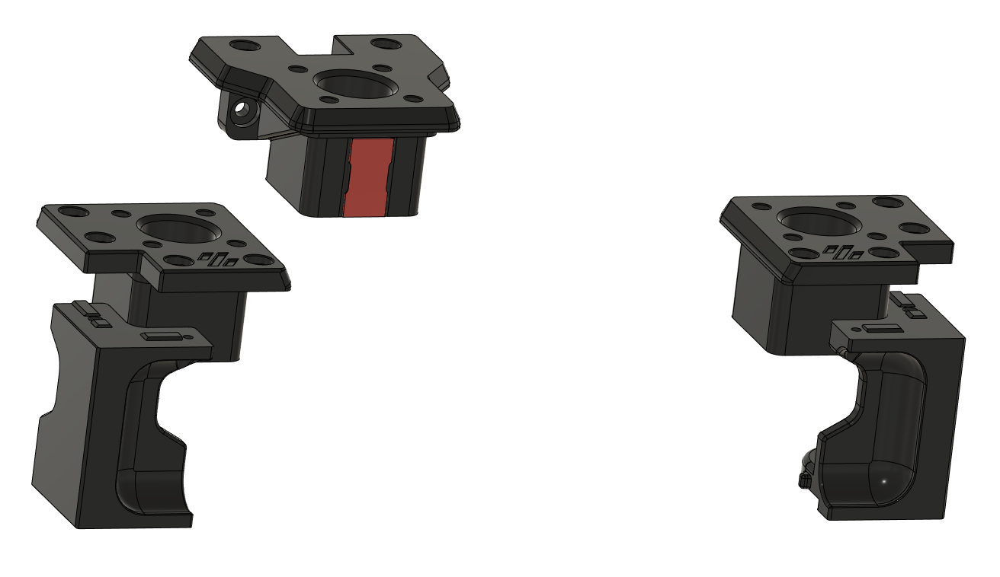
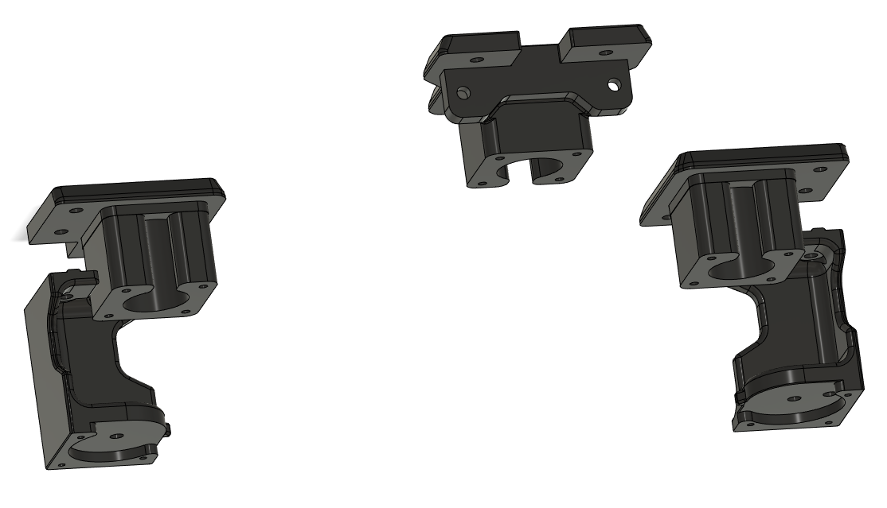

# VT Lowered Z Motor Mounts

## CHANGELOG
- 01.12.2022: Initial release, refere to description..

###### Description:
Since i wanted a full 350mm cubed Trident i had to go with regular Nema17 steppers with loose leadscrews and couplers. That meant i had to move the steppers out of the way/lower them to avoid the couplers protruding into the chamber AND taking up more space.
So that's where this was born, these move the steppers 29mm downwards into the skirt/electronics area. Just enough to make the couplers tuck down nicely giving a stock look.

- 3x modifed motor mounts (left, right & rear).
- Both front corners (these also needed to have a chamfer removed to drop the motors down enough), you only need one of each! In the rear you can use the stock VT ones!
- It's also a cover to close up the "gap" in the mounts (the gaps are there so you can tigthen or loosen the locking screws on the couplers without removing the whole stepper/leadscreew assembly) and make  champer somewhat "air tight" again.
- No extra screws or bolts needed, only the stock hardware in regards to mounting the stepper motors.

## Cutting the stepper axle shafts

Yeah, you most likely have to lob off a bit from your stepper axles to make this all come together. The amount you have to cut will vary depending on the parts you use, but hers a step by step "guide":
- Print the parts, and do a "dry fit" to see how much the coulpers you got protrude over the motor mounts (make sure to fully seat them on the stepper's axle).
- Then measure the distance from the top of the mount to the top of the coupler, add another 9mm to the measurement and you got the length you need to cut off.
- Before you go further and cut anything, dissasemble the stepper from the mount again WITH the coupler attached to the uncut shaft (giggetty). 
- Now measure the distance between the top of your stepper motor to the bottom of the coupler, and check that this lenght is LONGER than the previous mesurement.
- If the lenght is longer, it means you have enough shaft to work with (giggetty), and you can cut of the amount first mesured (with the added 9mm).
- IF HOWEVER, the distance is SHORTER you need to decide what you want to do (this is rather unlikely unless you've got a weird ass long coupler). Either you get a shorter coupler, or you have to cut the shafts shorter, making the couplers more visible and in extreme cases hindering max med movement. It's up to you at this point, but i would get hold of some other couplers!
- Note that you can cut the shafts more than the first mesurement to if you want to, i cut mine so short that i have about 2mm clearance between the top of the stepper motor and bottom of coupler (ainly to reduce potential wobble).
- With the shafts cut and deburred (allways deburr everything you cut) you can move forrward with the assembly.

And as allways, if you have any ideas for new features or improvement give me a ding!

###### Pictures:

###### Bom:
- 3x Stepper to leadscrew couplers - The ones you end up needing must be correct for the stepper shafts and leadscrews. I used steppers witht he standard 5mm shaft and 8mm leadscrews and went with these solid couplers : 

###### Printing:
- Default voron settings, correct orientation, no additional supports needed!

###### To-do List
- Non that i know of.

##### Credits: